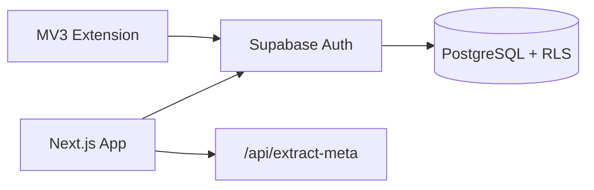
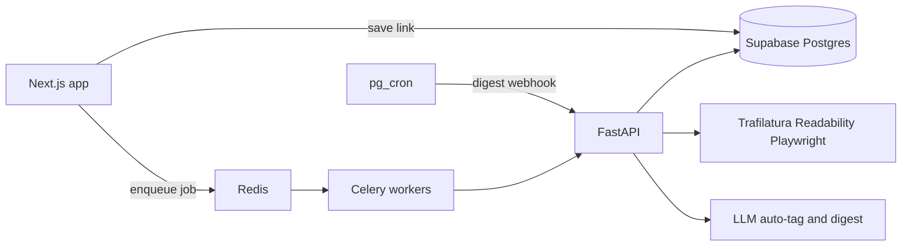
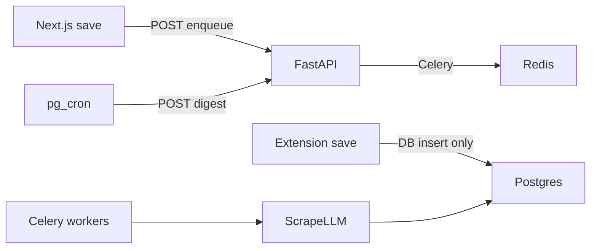

# Smart Bookmark Manager — Master plan

Single source of truth for phases, steps, and progress. Split phase notes remain in this folder for history; **this file is the plan to follow.**

| | |
| :--- | :--- |
| **Product** | Smart Bookmark Manager |
| **Repo** | [vivekaiworkspace/bookmark-web-app](https://github.com/vivekaiworkspace/bookmark-web-app) |
| **Current work** | Rules alignment on `cursor/rules-compliance-refresh` (Phases 1–3 already implemented) |
| **Updated** | 2026-08-16 |

**Documentation rule:** When a phase’s implementation is finished, update every relevant file in [`documentation/`](../documentation/) (user guides, limits, troubleshooting) **before** marking that phase complete. New users should be able to use the new features from those guides alone.

---

## Progress

| Phase | PRD window | Status | Evidence |
| :--- | :--- | :--- | :--- |
| 1. Core web + extension | Weeks 1–3 | **Done** | [PR #1](https://github.com/vivekaiworkspace/bookmark-web-app/pull/1) merged to `main` (2026-08-15) |
| 2. AI microservice + queues | Weeks 4–6 | **In PR** | Draft [PR #3](https://github.com/vivekaiworkspace/bookmark-web-app/pull/3); schema applied |
| 3. Productivity, billing, polish | Weeks 7–8 | **In progress** | Branch `cursor/phase-3-productivity-monetization` |

### Step checklist

**Phase 1**

- [x] Scaffold Next.js + Tailwind + shadcn, env example, folder layout
- [x] Phase 1 SQL migration (tables, extra columns, RLS) and Supabase clients
- [x] Email + Google auth, session proxy, first-login Inbox
- [x] Collections, tags, links CRUD, cards, notes, search, AND/OR filters, sort
- [x] `POST /api/extract-meta` (title / OG / favicon)
- [x] Manifest V3 popup, session handoff, one-click save with collection pre-select
- [x] Update [`documentation/`](../documentation/) for new users (getting started, sign-in, workspace, extension, limits, troubleshooting)

**Phase 2**

- [x] `002_phase2.sql`: `ai_summaries`, `user_ai_settings`, scrape/auto-tag status, suggested-tag columns, RLS
- [x] FastAPI service (`backend/`): extract, auto-tag, digest + service-role writes
- [x] Trafilatura + Readability scrape, Playwright fallback, tiktoken 4k–6k, persist `content_raw`
- [x] Redis + Celery in repo; enqueue on save (Next.js → FastAPI when up); extension via pending poll
- [ ] `pg_cron` against a public FastAPI URL (optional; Celery beat when Docker is running)
- [x] LLM auto-tag (existing tags + up to 3 new) and collection **suggestion**
- [x] Daily/weekly digest worker + custom prompt; **Run now** in the web app (no Docker)
- [x] Web: job status, suggested tags, digest list, prompt settings
- [x] Update [`documentation/`](../documentation/) for AI tags, digests, prompt settings, and new troubleshooting
- [ ] Deploy FastAPI + Redis + worker (Railway or Fly.io)

**Phase 3**

- [x] Stripe billing, customer portal, Free vs Pro gates
- [x] `reminders` table, datetime picker, Read Today queue
- [x] Resend email + Web Push (reminders and digests)
- [x] `pgvector` embeddings and semantic search / link Q&A
- [x] Update [`documentation/`](../documentation/) for reminders, Read Today, notifications, billing, and semantic search

---

## Product snapshot

**Problem:** Browser bookmarks are static; links are hard to find and rarely revisited.

**Vision:** Dynamic workspace — ingest, organize, AI-categorize, and resurface saved knowledge.

**Audience:** Developers, researchers, knowledge workers.

**Taxonomy**

- **Collections** — top-level workspaces (e.g. Inbox, AI Research)
- **Global tags** — account-wide, shared across collections
- **Link cards** — title, domain, favicon, OG image, notes, favorite
- **AI digest** — scheduled summaries from selected/queued bookmarks (Phase 2)

---

## Infrastructure (as of Phase 1)

| Item | Value |
| :--- | :--- |
| GitHub | `vivekaiworkspace/bookmark-web-app` (`main`) |
| App | Next.js 16 App Router, TypeScript, Tailwind, shadcn-style UI |
| Auth session | [`web/src/proxy.ts`](../web/src/proxy.ts) (Next.js 16; replaces `middleware.ts`) |
| Database | Supabase project **Smart Bookmark Manager** (`xpfkucssbdybylfcdqis`) |
| API URL | `https://xpfkucssbdybylfcdqis.supabase.co` |
| Region | `ap-northeast-1` |
| Auth | Email/password + Google OAuth |
| Extension | Unpacked Manifest V3 in [`extension/`](../extension/) |
| Local app | http://localhost:3000 |

**Auth dashboard (required for Google / local email)**

- Site URL: `http://localhost:3000`
- App redirect: `http://localhost:3000/auth/callback`
- Google Cloud redirect: `https://xpfkucssbdybylfcdqis.supabase.co/auth/v1/callback`
- Local testing: turn **Confirm email** off, or confirm users before sign-in
- `NEXT_PUBLIC_GOOGLE_AUTH=true` to show Continue with Google

Do not commit `web/.env.local`. Match anon key in [`extension/config.js`](../extension/config.js).

---

## Target architecture (full PRD)

```
[Browser Extension / Web App (Next.js)]
                  │
                  ▼
         [Supabase Platform]
    ├── Auth (Google SSO + Email)
    ├── PostgreSQL (RLS + pgvector)
    └── pg_cron (Scheduled triggers)
                  │ (Async Webhook / Queue)
                  ▼
     [Python FastAPI AI Microservice]
    ├── Task Queue: Redis + Celery
    ├── Scraper: Trafilatura + Mozilla Readability + Playwright
    ├── AI Pipeline: LLM APIs (token-capped with tiktoken)
    └── Notifications: Resend + Web Push   ← Phase 3
```

**Now (Phase 1):** Web + extension talk to Supabase only. Metadata scrape is a Next.js route, not FastAPI.



**After Phase 2:** save still hits Postgres immediately; scrape/tag/digest run on Celery. Next.js POSTs FastAPI to enqueue (does not open Redis). Workers share the FastAPI codebase. See [phase-2-ai-microservice.md](phase-2-ai-microservice.md) implementation notes.



Enqueue path (same components):



---

## Phase 1 — Core web and extension (done)

PRD weeks 1–3. Merged [PR #1](https://github.com/vivekaiworkspace/bookmark-web-app/pull/1).

### Shipped

- Next.js app: login, workspace sidebar, card grid
- Collections CRUD, colors, up/down reorder; Inbox via `ensure_inbox`
- Global tags; AND/OR filter; keyword search; sort (newest / last opened / favorites)
- Link cards: title, domain, favicon, OG image, favorite, notes (textarea + preview)
- Free-tier UI caps: **3 collections**, **10 tags** (no Stripe yet)
- Extension: last-used collection, save current tab; `/extension-auth` handoff or paste session JSON

### Schema ([`supabase/migrations/001_phase1.sql`](../supabase/migrations/001_phase1.sql)) — applied live

- Tables: `collections`, `tags`, `links`, `link_tags`, `notes` + RLS
- Extra vs original PRD DDL: `collections.sort_order`, `links.last_accessed_at`, `links.updated_at`, unique `(user_id, url)`
- `links.content_raw` column exists, unused until Phase 2
- `ensure_inbox` — execute for `authenticated` only (not `anon`)

### Layout

```
web/src/app/         Web (login, workspace, auth callback, extract-meta, extension-auth)
web/src/components/  UI + workspace
web/src/lib/supabase/ Browser/server clients + session helper
web/src/proxy.ts     Auth gate
supabase/migrations  Phase 1 SQL
extension/           MV3 popup + background
```

### Verification (done)

- Email and Google sign-in
- CRUD collections/tags/links, notes, filters
- Unpacked extension save appears in the web app
- User documentation in [`documentation/`](../documentation/)

---

## Phase 2 — AI microservice and queues (implemented)

PRD weeks 4–6. **Do not redo Phase 1.** Keep Next.js `/api/extract-meta` for fast card save; FastAPI enriches `content_raw` when Docker is running. **Run now** writes digests from Next.js.

Draft PR: [#3](https://github.com/vivekaiworkspace/bookmark-web-app/pull/3). Detail: [phase-2-ai-microservice.md](phase-2-ai-microservice.md).

### Steps

1. Migration `002_phase2.sql`
   - `ai_summaries`: `user_id`, `collection_id`, `content`, `prompt_used`, `generated_at`; RLS
   - `user_ai_settings`: `user_id` PK, `prompt_override`, `digest_frequency` (`off` \| `weekly` \| `daily`)
   - `links.scrape_status`, `links.auto_tag_status` (`pending` \| `ready` \| `failed`)
   - Also: `suggested_tag_names`, optional `suggested_collection_id`, optional `scrape_error` (needed for apply/dismiss UI)
   - Skip `vector` / `embedding` until Phase 3
2. FastAPI in `backend/`
   - `POST /api/v1/extract` — Trafilatura → Readability → Playwright; tiktoken 4,000–6,000 tokens
   - `POST /api/v1/auto-tag` — map to existing tags, suggest up to 3 new, optional collection; honor 10-tag free cap when inserting
   - Digest worker — links in the last period (`created_at`), custom prompt, write `ai_summaries`
3. Redis + Celery jobs: `extract_content`, `auto_tag`, `digest`
4. Next.js enqueues extract + auto-tag after save (non-blocking): server route → FastAPI → Redis. Extension saves: DB webhook/trigger or poll `pending` (extension does not talk to Redis)
5. `pg_cron` + `pg_net` (or scheduled Edge Function) POSTs digest jobs when frequency ≠ `off`. Enable extensions in the Supabase dashboard.
6. UI: scrape/tag status, apply/dismiss suggested tags, settings for prompt + frequency, digests list
7. Deploy FastAPI + Redis + worker (Railway or Fly.io). Local: docker-compose for Redis + API + worker
8. **Update [`documentation/`](../documentation/)** for auto-tag, digests, prompt settings, and troubleshooting

**Auth:** Next.js and cron send `AI_SERVICE_SECRET` (secret stays on the server, not in the browser). FastAPI uses Supabase **service role** only for job writes, always filtered by job `user_id`.

**Scrape:** block private/loopback URLs; Playwright only if extract is too thin; retries idempotent by `link_id`. Collection routing is a **suggestion** the user confirms.

**Detail:** [phase-2-ai-microservice.md](phase-2-ai-microservice.md) (implementation notes). Do not change this phase’s product or stack.

**Gating:** PRD marks auto-tag as Pro. **Ship AI for all users in Phase 2**; Stripe gates in Phase 3.

### Env (Phase 2)

- Next.js: `AI_SERVICE_URL`, `AI_SERVICE_SECRET`, optional `OPENAI_API_KEY` (Run now)
- FastAPI: `SUPABASE_URL`, `SUPABASE_SERVICE_ROLE_KEY`, `REDIS_URL`, `OPENAI_API_KEY`, `AI_SERVICE_SECRET`

### Verification

- Run now → `ai_summaries` row without Docker
- With worker: save a link → `content_raw` fills, tags suggested
- Custom prompt changes digest wording
- RLS: user A cannot read user B summaries
- Auto-tag respects the 10-tag cap; SSRF targets rejected
- Documentation updated for Phase 2 features

---

## Phase 3 — Productivity, monetization, polish

PRD weeks 7–8. Starts after Phase 2 is merged.

### Steps

1. **Stripe** — checkout + customer portal; sync `profiles.plan` (`free` \| `pro`); lift collection/tag caps for Pro; gate AI daily digest, custom prompts, semantic search, reminders
2. **Reminders** — PRD `reminders` table; picker on the card; Read Today queue; complete / dismiss
3. **Notifications** — Resend + Web Push for due reminders and digest delivery
4. **Semantic search** — `vector` extension, `links.embedding vector(1536)`, embed after scrape; natural-language search / link Q&A (Pro). Free keeps keyword search.
5. **Update [`documentation/`](../documentation/)** for reminders, Read Today, notifications, billing, and semantic search

### Free vs Pro (PRD)

| Feature | Free | Pro |
| :--- | :--- | :--- |
| Collections | Up to 3 | Unlimited |
| Global tags | Up to 10 | Unlimited |
| Ingestion | Manual tagging | AI auto-tag |
| Productivity | Notes | Notes + reminders + push |
| AI digest | 1 batch / week | Daily + custom prompts |
| Search | Keyword | Semantic (`pgvector`) |

Phase 1 already enforces 3 collections / 10 tags in the UI.

### Verification

- Stripe upgrade/downgrade changes limits immediately
- Reminder shows in Read Today; email/push fire once
- Semantic query is Pro-only
- Documentation updated for Phase 3 features

---

## Explicitly out of scope (all phases)

- Chrome Web Store listing (unpacked extension only until decided)
- Rewriting Phase 1 CRUD or replacing Next.js extract-meta for the fast path

---

## Risks (from PRD)

| Area | Decision | Mitigation |
| :--- | :--- | :--- |
| Scraping | Trafilatura + Readability | Playwright only for SPAs |
| Timeouts | Redis + Celery for scrape | Run now digest can run on the Next.js request |
| LLM cost | tiktoken | Cap scraped text at 4k–6k tokens |
| Notifications | Resend + Web Push | Phase 3; cron/webhooks dispatch |

---

## Related files

| File | Role |
| :--- | :--- |
| [documentation/README.md](../documentation/README.md) | User guide index (update at the end of every phase) |
| [README.md](../README.md) | How to run the app (operators) |
| [phase-1-mvp.md](phase-1-mvp.md) | Phase 1 detail (archived snapshot) |
| [phase-2-ai-microservice.md](phase-2-ai-microservice.md) | Phase 2 detail |
| [phase-3-productivity-monetization.md](phase-3-productivity-monetization.md) | Phase 3 detail |
| [schema-divergence.md](schema-divergence.md) | Extra columns/tables vs PRD DDL |
| [`supabase/migrations/001_phase1.sql`](../supabase/migrations/001_phase1.sql) | Phase 1 schema |
| [`supabase/migrations/003_phase3.sql`](../supabase/migrations/003_phase3.sql) | Phase 3 schema (applied live) |
