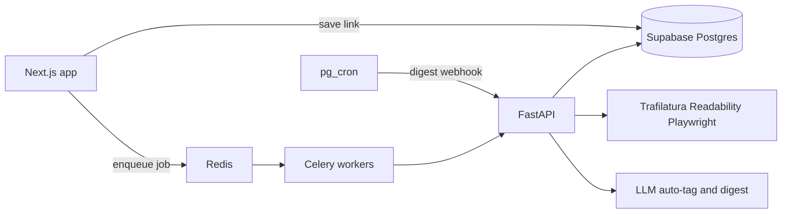

# Smart Bookmark Manager — Phase 2 AI microservice

**Status: planned (not started).**  
**Depends on:** [Phase 1](phase-1-mvp.md) merged to `main` ([PR #1](https://github.com/vivekaiworkspace/bookmark-web-app/pull/1)).

PRD Phase 2 (weeks 4–6): FastAPI on Fly.io / Railway / ECS; scrape pipeline; LLM auto-tag + scheduled digests via `pg_cron` and Celery/Redis.

**Still later:** [Phase 3](phase-3-productivity-monetization.md) — Stripe, Resend/Web Push, `pgvector` semantic search.

## Current baseline (do not redo)

- Next.js 16 app + extension + Supabase (`xpfkucssbdybylfcdqis`)
- Lightweight [`src/app/api/extract-meta/route.ts`](../src/app/api/extract-meta/route.ts) (title/OG/favicon only)
- `links.content_raw` exists but is unused
- No `ai_summaries`, no queue, no Python service

## Architecture

- **Queue:** Redis + Celery (PRD). Jobs: `extract_content`, `auto_tag`, `digest`.
- **Auth to FastAPI:** shared service secret for Next.js/pg_cron; FastAPI uses Supabase **service role** only for job writes, always scoped by `user_id` from the job payload.
- **Deploy:** FastAPI + Redis + worker as containers (Railway or Fly.io). Next.js stays as-is.

## Schema ([`supabase/migrations/002_phase2.sql`](../supabase/migrations/002_phase2.sql))

Add (from PRD, plus settings Phase 1 omitted):

- `ai_summaries` — `user_id`, `collection_id`, `content`, `prompt_used`, `generated_at`; RLS
- `user_ai_settings` — `user_id` PK, `prompt_override text`, `digest_frequency` (`off` | `weekly` | `daily`), `updated_at`
- `links.content_raw` already present; add `links.scrape_status` (`pending` | `ready` | `failed`) and `links.auto_tag_status`
- Skip `embedding` / `vector` until Phase 3

Enable `pg_cron` (or a Supabase scheduled function) to POST digest jobs for users with frequency != `off`.

## FastAPI (`services/ai/`)

- `POST /api/v1/extract` — Trafilatura → Mozilla Readability → Playwright for SPAs; parse title/OG/favicon; tiktoken truncate 4,000–6,000; write `content_raw`
- `POST /api/v1/auto-tag` — structured LLM output: existing tags to apply, up to 3 new tag names, optional collection id; honor free-tier tag cap (10) when inserting
- Digest worker — unread/recent links (or last period), custom prompt if set, persist markdown on `ai_summaries`

Keep Next.js `/api/extract-meta` for fast card save; Celery extract enriches `content_raw` in the background.

## Web app

- After insert/upsert link, enqueue extract + auto-tag (do not block the save UI)
- Card/detail: show scrape/tag status; apply or dismiss suggested tags
- Settings: custom digest/system prompt; daily vs weekly vs off
- Digests page: list `ai_summaries`, open markdown
- AI auto-tag is Pro in the PRD; **ship for all users in Phase 2**, gate with Stripe in Phase 3

## Env

- Next.js: `AI_SERVICE_URL`, `AI_SERVICE_SECRET`
- FastAPI: `SUPABASE_URL`, `SUPABASE_SERVICE_ROLE_KEY`, `REDIS_URL`, `OPENAI_API_KEY` (or chosen LLM), `AI_SERVICE_SECRET`

## Out of scope

Stripe, reminders, Resend, Web Push, `pgvector` Q&A, Chrome store packaging.

## Verification

- Save a link → `content_raw` fills, tags suggested
- Custom prompt changes digest wording
- Weekly/daily cron creates an `ai_summaries` row
- RLS: user A cannot read user B summaries
- **Docs:** update [`documentation/`](../documentation/) (workspace, limits, troubleshooting) for auto-tag, digests, and prompt settings before calling Phase 2 done
