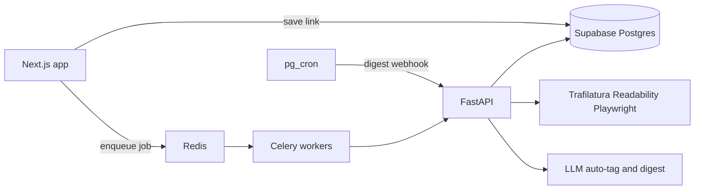
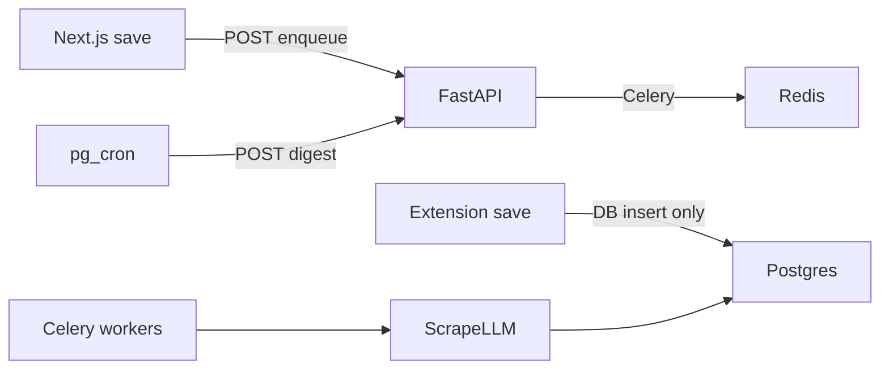

# Smart Bookmark Manager — Phase 2 AI microservice

**Status: implemented** — code on `cursor/phase-2-ai-microservice`, draft [PR #3](https://github.com/vivekaiworkspace/bookmark-web-app/pull/3). Schema `002_phase2.sql` applied on the live Supabase project.  
**Depends on:** [Phase 1](phase-1-mvp.md) merged to `main` ([PR #1](https://github.com/vivekaiworkspace/bookmark-web-app/pull/1)).

PRD Phase 2 (weeks 4–6): FastAPI scrape/auto-tag; Redis + Celery; digests. **Run now** and settings work from the Next.js app without Docker. FastAPI is required only for background scrape and auto-tag.

**Still later:** [Phase 3](phase-3-productivity-monetization.md) — Stripe, Resend/Web Push, `pgvector` semantic search.

## What shipped

- [`supabase/migrations/002_phase2.sql`](../supabase/migrations/002_phase2.sql) — `ai_summaries`, `user_ai_settings`, scrape/auto-tag status, suggested tags/collection, RLS
- [`services/ai/`](../services/ai/) — FastAPI + Celery (extract, auto-tag, digest jobs, SSRF, tiktoken cap)
- [`docker-compose.yml`](../docker-compose.yml) — Redis + API + worker (optional locally)
- Next.js: enqueue after save, Settings, Digests, **Run now** via [`src/lib/create-digest.ts`](../src/lib/create-digest.ts) (user session + optional `OPENAI_API_KEY`)
- User guides in [`documentation/`](../documentation/)

**Not done in this phase:** Railway/Fly deploy; enabling `pg_cron` against a public AI URL (Celery beat covers local scheduled ticks when Docker is up).

## Phase 1 baseline (kept)

- Next.js 16 app + extension + Supabase (`xpfkucssbdybylfcdqis`)
- Lightweight [`src/app/api/extract-meta/route.ts`](../src/app/api/extract-meta/route.ts) (title/OG/favicon only) — still the fast card path
- `links.content_raw` is filled by the FastAPI worker when that stack is running

## Architecture

Same stack, enqueue path made explicit (Next.js never opens Redis; workers do not HTTP back to FastAPI):

- **Queue:** Redis + Celery (PRD). Jobs: `extract_content`, `auto_tag`, `digest`.
- **Auth to FastAPI:** shared service secret for Next.js/pg_cron; FastAPI uses Supabase **service role** only for job writes, always scoped by `user_id` from the job payload.
- **Deploy:** FastAPI + Redis + worker as containers (Railway or Fly.io). Next.js stays as-is.
- **How enqueue actually works (same stack, not a new design):** Next.js does not open Redis. After a save, a Next.js API route (cookie session) POSTs FastAPI with `AI_SERVICE_SECRET`. FastAPI enqueues Celery. Workers run scrape/LLM in the same `services/ai/` package (no HTTP hop back to FastAPI). Extension saves only hit Postgres today — cover them with a DB webhook/trigger (or poll `pending` rows), not by teaching the extension Redis/FastAPI URLs. See [Implementation notes](#implementation-notes-do-not-change-scope).

## Schema ([`supabase/migrations/002_phase2.sql`](../supabase/migrations/002_phase2.sql))

Applied on the live project:

- `ai_summaries` — `user_id`, nullable `collection_id`, `content`, `prompt_used`, `generated_at`; RLS; index `(user_id, generated_at desc)`
- `user_ai_settings` — `user_id` PK, `prompt_override`, `digest_frequency` (`off` | `weekly` | `daily`), `digest_timezone` (default UTC)
- `links.scrape_status` / `auto_tag_status` (`pending` | `ready` | `failed`), `scrape_error`, `suggested_tag_names`, `suggested_collection_id`
- Skip `embedding` / `vector` until Phase 3

`pg_cron` SQL is documented in the migration comments; enable in the dashboard when FastAPI is on a public URL.

## FastAPI (`services/ai/`)

- `POST /api/v1/extract` — Trafilatura → Mozilla Readability → Playwright for SPAs; tiktoken truncate 4,000–6,000; write `content_raw`
- `POST /api/v1/auto-tag` — structured LLM output: existing tags, up to 3 new names, optional collection; UI apply honors the 10-tag cap
- `POST /api/v1/jobs` — enqueue `extract_and_tag`, `digest`, or run `digest_tick`
- Celery beat: poll `scrape_status = pending` (extension saves); hourly digest tick (UTC)

Keep Next.js `/api/extract-meta` for fast card save; Celery extract enriches `content_raw` in the background.

## Web app

- After insert/upsert link, `POST /api/ai/enqueue` (non-blocking). If FastAPI is down, the save still succeeds.
- Card/detail: scrape/tag status; apply or dismiss suggested tags; confirm collection move
- Settings: custom digest prompt; daily / weekly / off
- Digests: list `ai_summaries`; **Run now** writes a row via the Next.js session (`OPENAI_API_KEY` if set, otherwise a markdown list of recent links)
- AI auto-tag is Pro in the PRD; **shipped for all users in Phase 2**, gate with Stripe in Phase 3

## Env

- Next.js: `AI_SERVICE_URL`, `AI_SERVICE_SECRET`, optional `OPENAI_API_KEY` / `OPENAI_MODEL` (Run now)
- FastAPI: `SUPABASE_URL`, `SUPABASE_SERVICE_ROLE_KEY`, `REDIS_URL`, `OPENAI_API_KEY`, `AI_SERVICE_SECRET`

## Out of scope

Stripe, reminders, Resend, Web Push, `pgvector` Q&A, Chrome store packaging, production FastAPI host.

## Verification

- **Run now** creates an `ai_summaries` row without Docker
- With Docker + keys: save a link → `content_raw` fills, tags suggested
- Custom prompt changes digest wording
- RLS: user A cannot read user B summaries
- Auto-tag apply does not exceed the 10-tag cap
- Private/loopback scrape URLs are rejected
- Docs: [`documentation/`](../documentation/) covers auto-tag, digests, Run now, and troubleshooting

## Implementation notes (shipped)

These close gaps in the Phase 1 app. Stack, jobs, tables, and product remain the same.

### Enqueue and workers

- Browser never holds `AI_SERVICE_SECRET`. Next.js server route authenticates the user, then POSTs FastAPI.
- FastAPI `POST /api/v1/jobs` (or extract + auto-tag) validates the secret and enqueues Redis/Celery.
- Celery workers import scrape/LLM from `services/ai/` directly. The architecture diagram’s `Celery --> API` line means “workers use the FastAPI service codebase,” not a second HTTP call.
- On upsert of the same `(user_id, url)`: re-run extract/auto-tag only if status is `failed` or `content_raw` is empty; skip if already `ready`.

### Extension

[`extension/background.js`](../extension/background.js) upserts `links` via REST and never sees Redis. Preferred: `pg_net` / trigger on `links` INSERT (and qualifying UPDATE) POSTs FastAPI. Fallback: worker polls `scrape_status = pending`. Do not add FastAPI URLs to the extension.

### Schema extras (same migration `002_phase2.sql`)

- `links.suggested_tag_names text[]` (or jsonb) — LLM names not yet applied; clear on apply or dismiss.
- `links.suggested_collection_id` — **suggest** a move; user confirms in the UI. Do not auto-move out of Inbox.
- `links.scrape_error text` — short failure reason for the card.
- New links: `scrape_status` and `auto_tag_status` default `pending`.
- `user_ai_settings`: insert on first Settings visit, or default row (frequency `weekly`) via trigger. Check constraint on `digest_frequency`.
- `ai_summaries.collection_id` nullable — **one digest per user per period** (all collections). Index `(user_id, generated_at desc)`.
- Digest window: daily = `created_at` last 24h; weekly = last 7d. Cron timezone UTC unless `digest_timezone` is added (default UTC).
- RLS on `ai_summaries` and `user_ai_settings`: `user_id = auth.uid()`. Service role bypasses RLS; workers always filter by job `user_id` and load the link row rather than trusting a client-supplied user.

### Scrape safety and local run

- Block private/loopback IPs and non-http(s) URLs (SSRF). Timeout and response size cap in addition to tiktoken 4,000–6,000.
- Playwright only when Trafilatura + Readability yield too little text; worker needs enough RAM.
- Celery retries with backoff; idempotent by `link_id`.
- Default LLM: OpenAI structured JSON; `OPENAI_API_KEY` stays swappable. At the 10-tag cap, attach existing tags only.
- Local: docker-compose for Redis + FastAPI + worker. Railway/Fly remains the deploy step (step 7 in the master plan).

### Cron

Enable `pg_cron` and `pg_net` in the Supabase dashboard. Schedule a job that selects `user_ai_settings` where `digest_frequency != 'off'` and POSTs FastAPI (`AI_SERVICE_SECRET`). If `pg_cron` is unavailable on the project, use a scheduled Edge Function with the same contract.

### Web UI

- Do not block save. Poll the link row while status is pending.
- Card/detail: pending / ready / failed; apply/dismiss suggested tags; optional “Move to {collection}?”
- Settings (`/settings`) and Digests (`/digests`) with **Run now**.
- Run now does not call FastAPI; it uses [`src/lib/create-digest.ts`](../src/lib/create-digest.ts).
